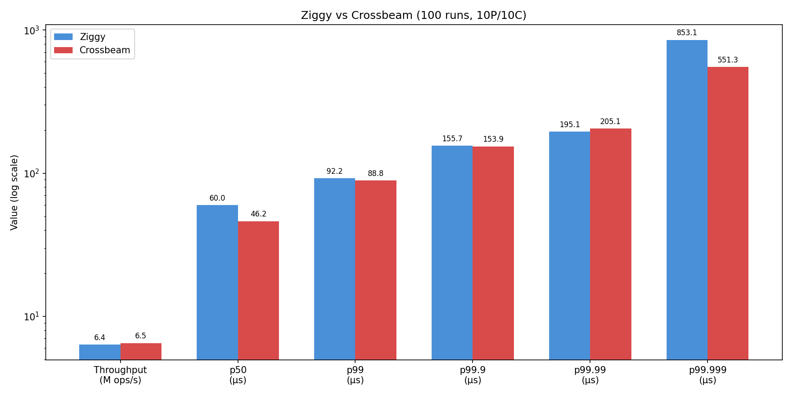

# ziggy

MPMC ring buffer in Zig. Lock-free, sequence-per-slot design.

## usage

```zig
const RingBuffer = @import("ziggy").RingBuffer;

var ring = try RingBuffer(u64).init(allocator, 512);
defer ring.deinit();

// producer
ring.produce(42);

// consumer
if (ring.tryConsume()) |val| { ... }
// or blocking:
if (ring.consume()) |val| { ... }

ring.close();
```

## build

```
zig build -Doptimize=ReleaseFast   # build
zig build test                      # run tests
zig build run -Doptimize=ReleaseFast  # run benchmarks
```

## benchmarks

10P/10C on 20-core machine, 100 runs each:

| metric     | ziggy    | crossbeam | diff |
|------------|----------|-----------|------|
| throughput | 6.36 M/s | 6.51 M/s  | -2%  |
| p50        | 60.0 µs  | 46.2 µs   | -30% |
| p99        | 92.2 µs  | 88.8 µs   | -4%  |
| p99.9      | 155.7 µs | 153.9 µs  | ~0%  |
| p99.99     | 195.1 µs | 205.1 µs  | +5%  |
| p99.999    | 853.1 µs | 551.3 µs  | -55% |



crossbeam wins on median latency, ziggy is competitive on throughput and p99.9.

173 lines of zig vs 639 lines of rust (array.rs only, full crossbeam-channel is 8600+ lines).

to run crossbeam benchmark:
```
cd benchmarks/crossbeam
cargo run --release
```
